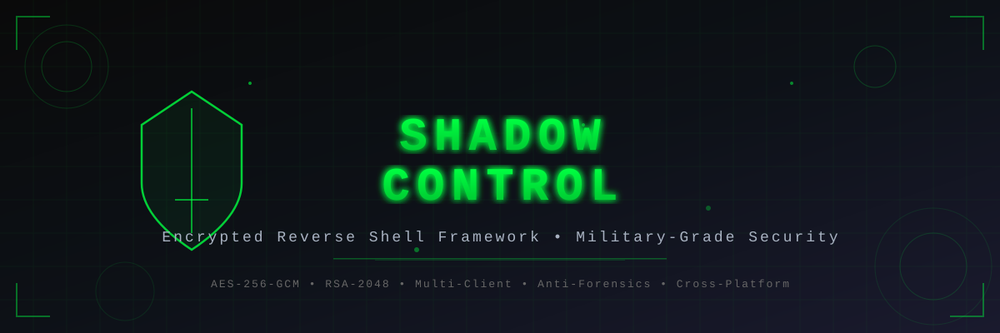

<div align="center">



<br><br>

# 🔐 Shadow Control - Encrypted Reverse Shell Framework

[](https://www.python.org/downloads/)
[](LICENSE)
[]()
[]()
[](CHANGELOG.md)

A sophisticated, encrypted reverse shell framework with advanced features including secure key exchange, real-time system monitoring, and comprehensive remote administration capabilities.

## ⚠️ Disclaimer

**FOR EDUCATIONAL AND AUTHORIZED TESTING PURPOSES ONLY**

This tool is designed for:
- Security researchers and penetration testers
- System administrators for remote management
- Educational purposes in cybersecurity courses

**Unauthorized access to computer systems is illegal.** Always obtain proper authorization before using this tool. The developers assume no liability for misuse or damage caused by this software.

## 🚀 Features

### Core Security Features
- **AES-256-GCM Encryption**: All communications encrypted with authenticated encryption
- **RSA-2048 Key Exchange**: Secure asymmetric key exchange protocol
- **Anti-Analysis Measures**: Gutmann method file wiping for secure deletion
- **Session Management**: Unique session IDs and heartbeat monitoring

### Remote Administration Capabilities
- **System Information Gathering**
  - Hardware specifications (CPU, RAM, Disk)
  - Windows product keys extraction from registry
  - Privilege level detection (Administrator/Root)
  - Disk usage analysis across all partitions
  - CPU core count and memory statistics

- **Surveillance Features**
  - Desktop screenshot capture (PNG format)
  - Webcam photo capture (JPEG format)
  - Real-time process monitoring (Top 50 processes)
  - Network connection and interface monitoring

- **File Operations**
  - Bidirectional file transfer with 50MB limit
  - Encrypted file upload/download
  - Recursive directory support for downloads

- **Shell Access**
  - Full interactive shell with directory navigation
  - Command execution with proper encoding handling
  - Cross-platform compatibility (Windows/Linux)
  - 30-second command timeout protection

### Advanced Features
- **Automatic Reconnection**: Persistent connection with retry logic (5 attempts)
- **Heartbeat System**: Connection health monitoring every 30 seconds
- **Multi-Client Support**: Handle multiple simultaneous connections via threading
- **Date-Based Port Calculation**: Dynamic port assignment based on current date (DDMM format)
- **Kill Switch**: Secure self-destruct mechanism with Gutmann method wiping

## 📋 Requirements

### System Requirements
- **Python**: 3.7 or higher
- **Operating Systems**: 
  - Windows 7/8/10/11
  - Linux (Ubuntu 18.04+, Debian 10+, CentOS 7+, etc.)
- **Network**: Outbound internet connection
- **Permissions**: 
  - Administrator/root privileges recommended for full functionality
  - Camera access for webcam features

### Python Dependencies
```bash
pip install -r requirements.txt
